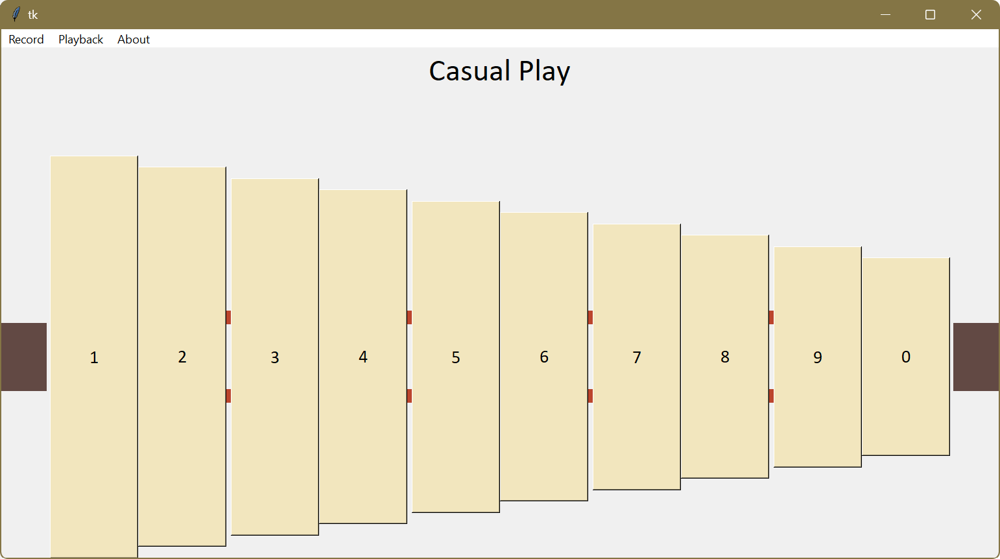

# Virtual Gender: a Windows Programming Final Project

Virtual Gender is a Tkinter-based program simulating a Gender, a musical instrument originating from Bali, Indonesia.

## Demo Video

## Acknowledgment

- This application was built by the team that was consisted of Abi, Ariel, Arya, and Harshada.
- Special thanks to Kresnanta for helping on recording the sample of each gender blade sound.
